# Tareekh: Court Case Monitoring for District Courts, High Courts and the Supreme Court


<div align="justify">

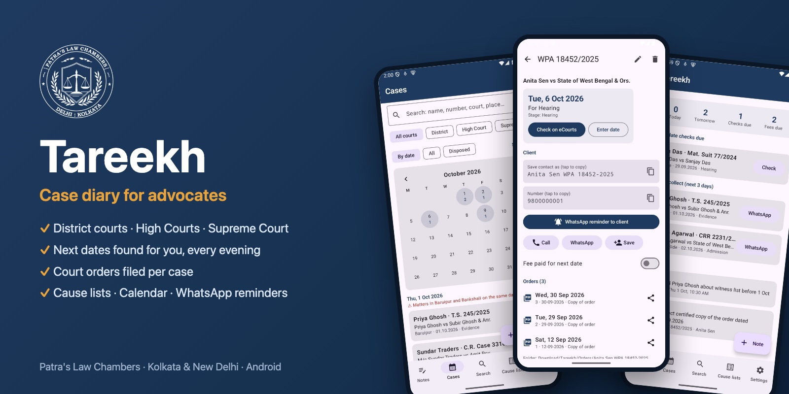

<p align="center"><a href="https://github.com/advocatesudippatra-spec/tareekh-court-case-monitoring/raw/main/Tareekh-2.1.apk">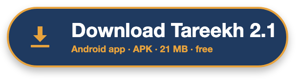</a></p>

<p align="center">Tap the button on your Android phone to download the app directly · <a href="docs/Tareekh-Screen-Guide.pdf">Screen guide (PDF)</a> · <a href="docs/Tareekh-Features.pdf">Features (PDF)</a></p>

**Tareekh** (*tareekh*, the date of a hearing) is an Android case diary for advocates. It keeps every matter you appear in, in any district court in India, any of the 25 High Courts or the Supreme Court, and does the tiring part of practice for you: it finds each next date on eCourts, files the court's orders in a folder for every case, reminds you of hearings and fees, puts every date in your Google Calendar, and lets you send your client a WhatsApp reminder in one tap. It reads summonses, orders and eCourts screenshots with the phone's camera, and imports your whole eCourts app case list at once.

Tareekh opens the **public** case status pages of eCourts, the High Courts and the Supreme Court inside the app. You type every CAPTCHA; everything around it is done for you. Tareekh is not affiliated with eCourts, NIC or any court.

**Guide (every feature, and every screen explained with arrows):** [`docs/index.html`](docs/index.html) · PDF: [screen guide](docs/Tareekh-Screen-Guide.pdf), [features](docs/Tareekh-Features.pdf) · **Download the app:** [Tareekh-2.1.apk](https://github.com/advocatesudippatra-spec/tareekh-court-case-monitoring/raw/main/Tareekh-2.1.apk)

`#Tareekh` `#CaseDiary` `#eCourts` `#CourtCaseStatus` `#CauseList` `#DistrictCourt` `#HighCourt` `#CalcuttaHighCourt` `#SupremeCourtOfIndia` `#LegalTech` `#AdvocateApp` `#LawyerApp` `#IndianLaw` `#NextDate` `#HearingReminder` `#CourtOrders` `#AndroidApp` `#PatrasLawChambers`

**Contents:** [What's new](#whats-new-in-21) · [Your day](#your-day-with-tareekh) · [How it works](#how-it-works) · [Features](#features) · [Screen guide](#screen-guide) · [Download and install](#install) · [Your data](#your-data) · [Copyright](#copyright) · [Questions](#questions) · [About](#about-patras-law-chambers)

---

## What's new in 2.1

- **Search inside Tareekh**: for District Courts, the High Courts and the Supreme Court, search by **case type + number + year**, by **party name + year**, by **filing number** (Supreme Court: **diary number**), or by **CNR**. Case types are picked from each court's own list. The court's CAPTCHA picture is shown in Tareekh; you type the answer, and the case (or a list of cases to choose from) opens on Tareekh's own screen. *Court's page* shows the court's website at any time.
- **Summons reading**: case numbers such as `CS/ 213819/26`, the person summoned (*To.*), the complainant and short Act names (BNS, BNSS, BSA, IPC, CrPC, NI Act…) are read more reliably.
- **Optional AI reading**: in Settings you can choose Google Gemini, OpenAI, Claude, Qwen or Kimi with your own API key; the page picture is then also read by that service. Off by default; the phone's own reading is always used as well.

## Your day with Tareekh

| When | What Tareekh does | You do |
|---|---|---|
| **8:00 AM** | Today's matters; a fee reminder for hearings 3 days away; a reminder for hearings 2 days away, with **Send WhatsApp reminder** to the client | Tap to send, if you wish |
| **During the day** | Every hearing is in your Google Calendar, with alerts 2 days before and at 8 am | Nothing |
| **6:30 PM** | *Check next date* for the day's hearings. Tap it: the court's page opens already filled in | **Type the CAPTCHA** |
| **After the CAPTCHA** | The next date, stage, hearing history and **every new order** are saved; the calendar moves the hearing | Nothing |
| **8:00 PM** | Tomorrow's matters, with court, purpose and client | Nothing |
| **Next two days** | If eCourts has not shown the new date yet, Tareekh asks again at 6:30 pm; after three days it tells you to check or enter it | Only if asked |
| **Any time** | A summons comes: share or upload it to Tareekh, which reads it and files the case | Check and save |

## How it works

```
 Summons / order / screenshot ──► read on the phone ──► your case list ◄── eCourts app "My Cases" import
                                                              │
         6:30 pm check ──► court's own page, filled in ──► you type the CAPTCHA
                                                              │
                     next date · stage · hearings · orders (PDF, one folder per case)
                                                              │
        Google Calendar · 8 am / 8 pm reminders · fee reminder · WhatsApp reminder to the client
```

Everything is stored on your phone. Tareekh talks only to the court websites you open and, when you ask it to, to WhatsApp and your phone's calendar.

## Features

**Your cases in one place**
- Add a case by hand, by typing it the way you write it (*TS 245/2026 Baruipur*, *WPA 12345/2024*), or from a document.
- **Upload or share** a summons, order, notice, plaint or eCourts screenshot (PDFs up to 3 pages). The phone reads it and fills in the court, case type, number, year, hearing date and both parties. Tables in screenshots are read column by column.
- If an important detail is missing, Tareekh says **"Court details are missing"**: fill them in, or save as it is.
- You choose **whose name the case is saved under** (petitioner, respondent or your client), as *Name + case number* (`Saman WPA 12345-2024`) or *Name only*. The name always comes first.
- **Import your eCourts app case list** (*myCases.txt* and *hcMyCases.txt*) in one step; imported again, cases are updated, never duplicated.

**Next dates, found for you**
- **Check on eCourts** opens the court's own page with the case already filled in (CNR, or case type, number and year).
- The next date, stage, judge, parties, acts and full hearing history are read and saved.
- **Manual override:** enter the date yourself when eCourts is down or late.
- When a court website is down, a plain message says so, with *Try again*.

**Court orders, filed per case**
- Every order uploaded on eCourts is downloaded when you open the case there, including orders that appear late on High Court pages.
- Saved in `Download/Tareekh/Orders/<client name> <case number>/`, one folder per case, each file named by date (`2026-09-12 Order 1.pdf`). Open or share them from the case; they stay even if the app is removed.

**Reminders and calendar**
- Every hearing goes into your **Google Calendar** with alerts 2 days before and at 8 am, and moves when the date changes.
- 8 am and 8 pm lists, the 6:30 pm check, a fee reminder 3 days before, and a warning when two courts clash on one day.
- **Notes** with their own reminders, alone or linked to a case.

**Your clients**
- One-tap **Call**, **WhatsApp** and **Save contact** (saved under the client's name followed by the case number).
- **WhatsApp reminder to client**: opens the client's chat with the hearing reminder typed in your own words (case, court, date, purpose filled in). You tap Send. If no number is saved, Tareekh asks for it once.

**Courts across India**
- **District courts of every state:** choose state, district and court complex from eCourts' own lists.
- **All 25 High Courts and their 44 benches** (Appellate Side, Original Side, circuit and regional benches), each on its own eCourts page.
- The case types of every High Court bench (5,691 of them: WPA, CRR, CRM (A), FMA…) are built in, so a paper that shows only *"WPA 12345 of 2024"* is recognised as a Calcutta High Court case.
- **Supreme Court** case status and cause lists.

**Cause lists**
- High Court, district court and Supreme Court cause lists for yesterday, today, tomorrow or any date.
- High Court lists open by themselves (no CAPTCHA) and say *not published yet* when that is so. Lists are saved as PDF in `Download/Tareekh/Cause lists/`.

## Screen guide

Every screen of Tareekh, part by part. The numbered arrows point at each part of the screen; the list under each picture explains it. The cases shown are made-up examples. (The same guide as a PDF: [screen guide](docs/Tareekh-Screen-Guide.pdf).)

### 1 · Notes: your day at a glance

The first tab. It opens every time you start Tareekh.

<p align="center">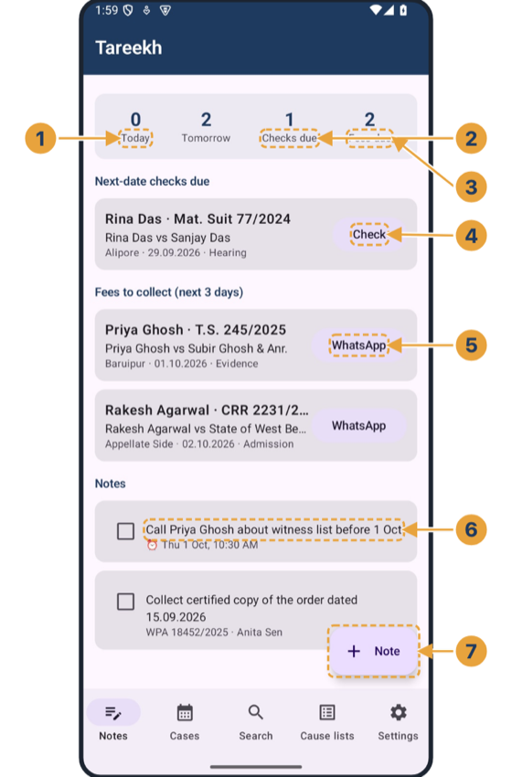</p>

1. **Today / Tomorrow**: How many matters are fixed today and tomorrow. Tap to open them in Cases.
2. **Checks due**: Hearings that have happened and whose next date is not yet known. Each needs a quick check on eCourts.
3. **Fees due**: Clients with a hearing in the next 3 days whose fee is not marked paid (only cases with a phone number).
4. **Check**: Opens eCourts for that case with everything filled in; you type the CAPTCHA, the new date is saved.
5. **WhatsApp (fees)**: Opens the client's WhatsApp with a polite fee reminder already typed.
6. **Notes**: Your own notes. A note can have a reminder (alarm) and can be linked to a case. Tick it when done.
7. **New note**: Write a note, set a reminder date and time, or link it to a case.

### 2 · Cases: every matter, by date

All your cases, with a month calendar of hearings.

<p align="center">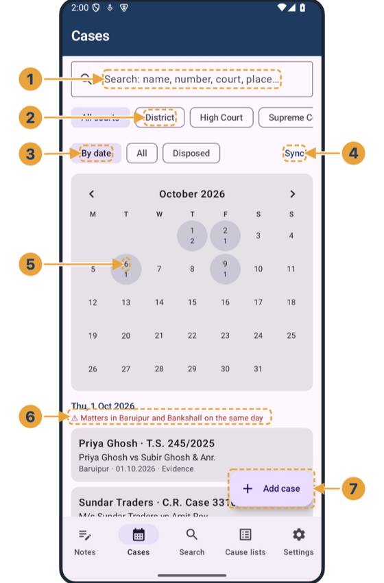</p>

1. **Search**: Type any part of a name, number, court or place to find a case.
2. **Court filter**: Show all courts, or only District, High Court or Supreme Court cases.
3. **By date / All / Disposed**: By date shows the calendar and upcoming hearings; All lists everything; Disposed shows closed cases.
4. **Sync**: Writes every hearing into your phone's Google Calendar (with alerts 2 days before and at 8 am).
5. **Calendar**: Each day shows how many matters are fixed. Tap a day to see only its cases and your other calendar entries.
6. **Clash warning**: Warns when you have matters in two different court towns on the same day.
7. **Add case**: Add a case by hand, or upload a summons, order or screenshot for Tareekh to read.

### 3 · A case

Tap any case to open it. Everything about the matter is on this one page.

<p align="center">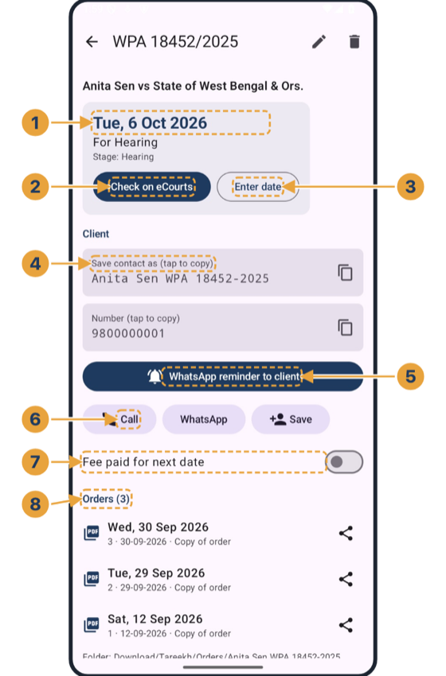</p>

1. **Next date**: The next hearing date, its purpose and the case stage.
2. **Check on eCourts**: Opens the court's page filled in (CNR, or case type, number and year). Type the CAPTCHA; the next date, hearings and orders are saved.
3. **Enter date**: Manual override: type the next date yourself if eCourts is down or late. The calendar is updated too.
4. **Save contact as**: The name to save your client under in your phone: name first, then the case number. Tap to copy.
5. **WhatsApp reminder to client**: Opens the client's WhatsApp with the hearing reminder typed (case, court, date). You tap Send.
6. **Call / WhatsApp / Save**: Call the client, message them, or save them as a phone contact in one tap.
7. **Fee paid**: Mark the fee as paid so no fee reminder is sent for this date.
8. **Orders**: Court orders downloaded from eCourts, newest first. Tap to open; the share icon sends it on WhatsApp.

### 4 · Checking a case on eCourts (example)

What you see after tapping Check on eCourts and typing the CAPTCHA. (Illustration made with a sample page: on the real court site the layout is the court's own.)

<p align="center">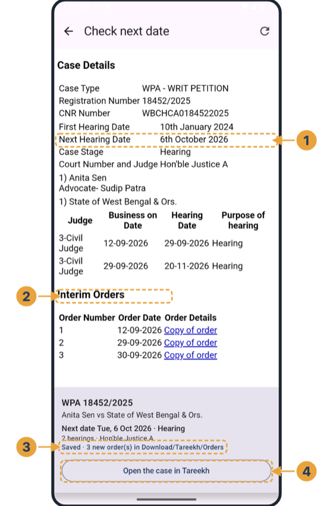</p>

1. **Next date read from the court**: Tareekh reads the next hearing date, stage, judge, parties and hearing history from the page.
2. **Orders on the page**: Every order listed on the court's page is downloaded into the case's folder: Download/Tareekh/Orders/<client> <case>.
3. **Saved automatically**: For a case already in your list, the new date and new orders are saved by themselves. You are told how many orders were saved.
4. **Open the case in Tareekh**: Jump back to the case page. A new case shows 'Save to My Cases (with orders)' here instead.

### 5 · Adding a case from a document

Upload (or share to Tareekh) a summons, order, notice or eCourts screenshot; PDFs up to 3 pages are read too.

<p align="center">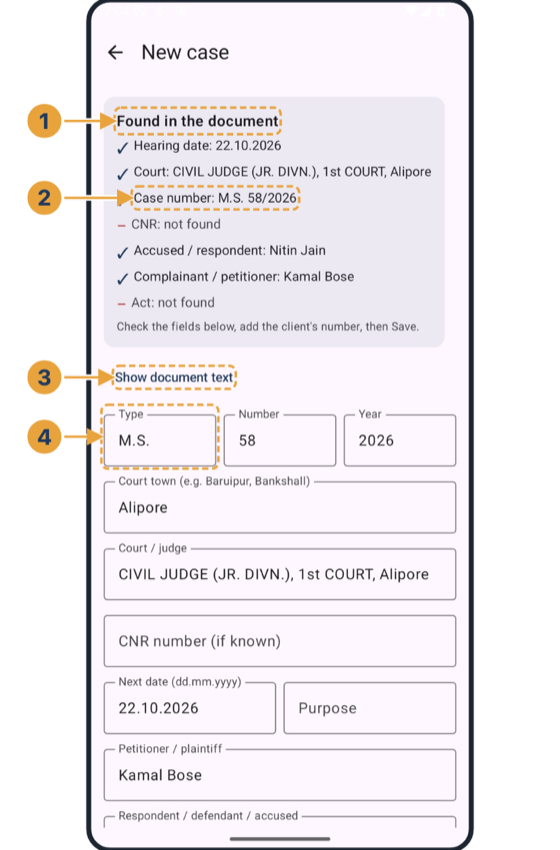</p>

1. **Found in the document**: What Tareekh read: ✓ means found, – means not found. Check it before saving.
2. **Case details**: Case type, number, year, court, hearing date and both parties are filled in for you.
3. **Show document text**: See (and copy) exactly what the phone read, useful if something was read wrongly.
4. **Edit anything**: Every field can be corrected by hand before you save.

### 6 · Whose name to save the case under

Asked every time you save a new case.

<p align="center">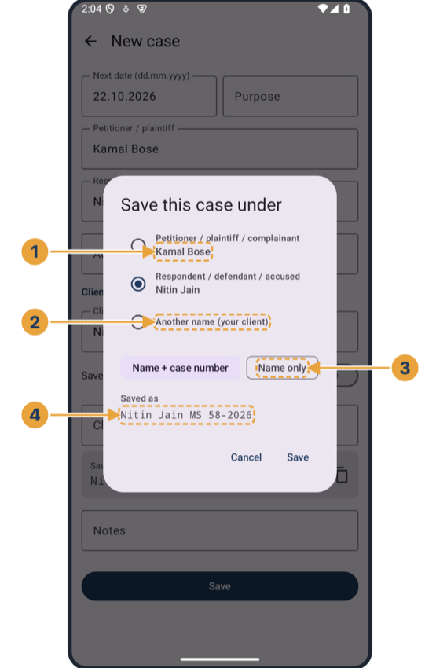</p>

1. **Petitioner / respondent**: Choose the party who is your client; the full name is used.
2. **Another name**: Or type your client's name, e.g. a company contact.
3. **Name + number / Name only**: Save as 'Name TYPE NO-YEAR' (the name always first) or just the name.
4. **Saved as**: Preview of the name used for the case, the contact and the orders folder.

### 7 · When court details are missing

If the document did not give an important detail, Tareekh says so before saving.

<p align="center">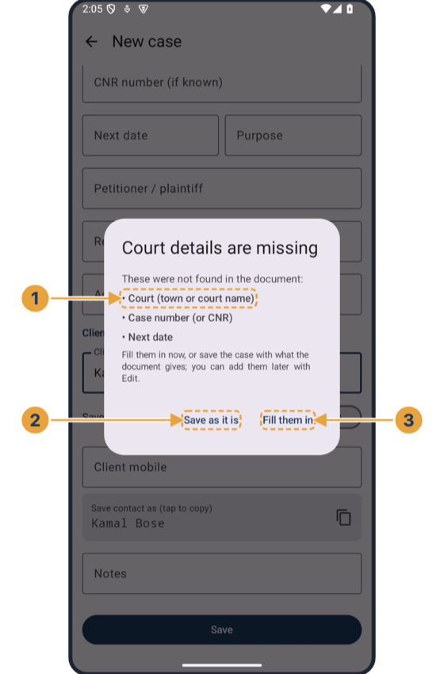</p>

1. **What is missing**: Court, case number or CNR, case type, year, next date or parties: whatever could not be found.
2. **Save as it is**: Save with what the document gave. You can add the rest later with Edit.
3. **Fill them in**: Go back to the form and type the missing details now.

### 8 · Search: district courts

Court-wise search. The kind of court with most of your cases opens first.

<p align="center">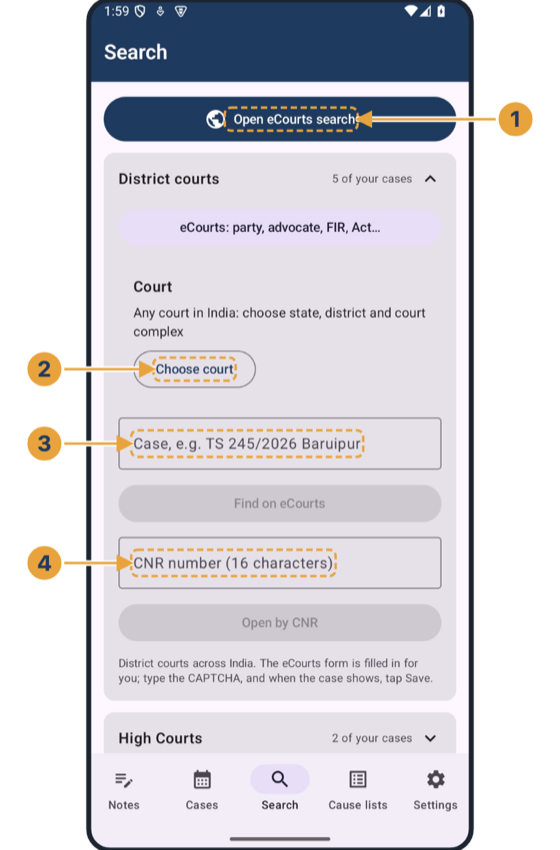</p>

1. **Open eCourts search**: The full eCourts search page (party, advocate, FIR, Act and more).
2. **Choose court**: Any court in India: state, district and court complex, straight from eCourts' own lists. Recent courts are remembered.
3. **Find a case**: Type the case as you would write it; Tareekh fills the eCourts form and you type the CAPTCHA.
4. **Open by CNR**: The quickest search: the 16-character CNR number.

### 9 · Search: High Courts

All 25 High Courts and their 44 benches, opened on their own eCourts pages.

<p align="center">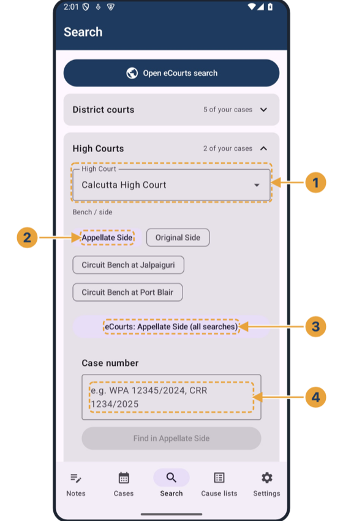</p>

1. **High Court**: Choose the High Court; your last choice is remembered.
2. **Bench / side**: Appellate Side, Original Side, circuit benches: every bench has its own page.
3. **All searches**: That bench's full eCourts menu (case number, party, advocate, orders, cause list).
4. **Case number**: WPA, CRR, FMA…: the case type, number and year are filled in; you type the CAPTCHA.

### 10 · Choosing any court in India

State › district › court complex, with a filter box.

<p align="center">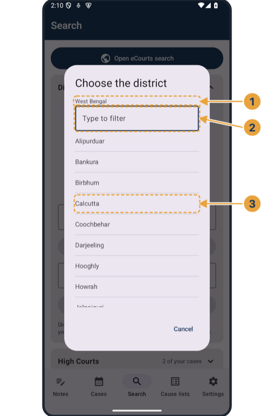</p>

1. **Where you are**: The state already chosen; next the district, then the court complex.
2. **Type to filter**: Type a few letters to find a district or court quickly.
3. **Lists from eCourts**: The lists are read live from eCourts, so every court in India is there.

### 11 · Cause lists

Today's (or any day's) cause list for a High Court bench, a district court or the Supreme Court.

<p align="center">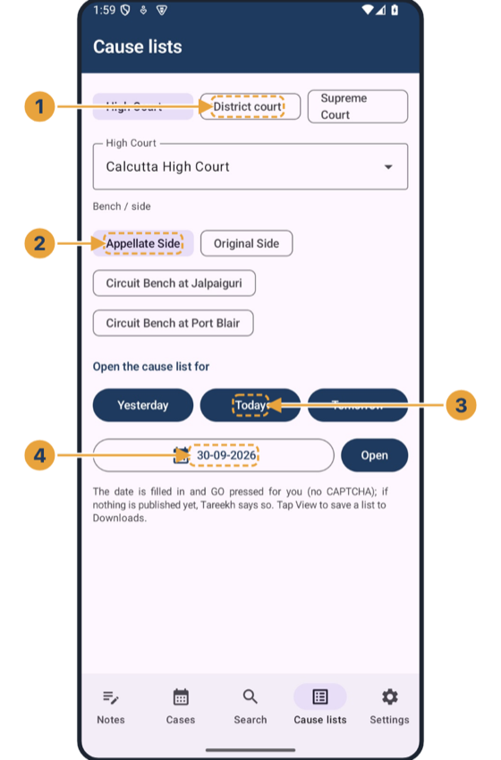</p>

1. **Court**: High Court, District court or Supreme Court.
2. **Bench**: For High Courts, choose the bench or side.
3. **Yesterday / Today / Tomorrow**: One tap opens the list for that day.
4. **Any date**: Pick a date from the calendar, then Open.

### 12 · A High Court cause list

High Court lists open by themselves (no CAPTCHA).

<p align="center">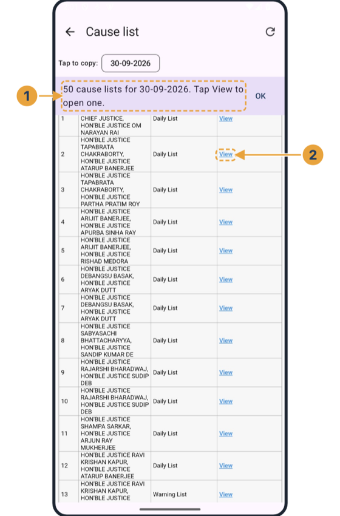</p>

1. **What was found**: How many lists are published for the date, or 'not published yet'.
2. **View**: Downloads the bench's list as a PDF into Download/Tareekh/Cause lists and opens it.

### 13 · WhatsApp reminder without a number

If no phone number is saved for the case.

<p align="center">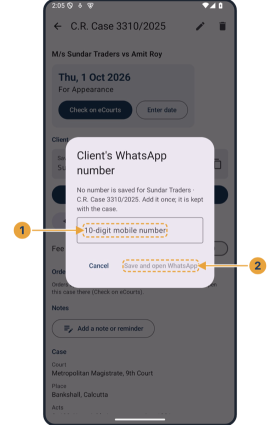</p>

1. **Client's number**: Type it once: it is saved with the case.
2. **Save and open WhatsApp**: Saves the number and opens WhatsApp with the reminder typed; you tap Send.

### 14 · Reminders on your phone

Tareekh reminds you even when the app is closed.

<p align="center">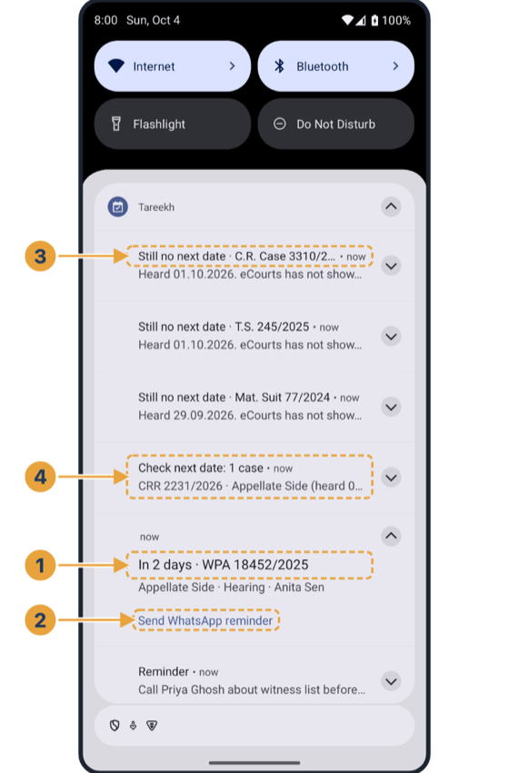</p>

1. **2 days before**: Each hearing two days ahead, with the court, purpose and client.
2. **Send WhatsApp reminder**: Opens the client's WhatsApp with the reminder typed (or asks for the number first).
3. **Still no next date**: If eCourts still shows no new date 3 days after a hearing, check or enter it.
4. **6:30 pm check**: Hearings of the day: tap to check each on eCourts with one CAPTCHA.

### 15 · A note with a reminder

From the Notes tab or from any case.

<p align="center">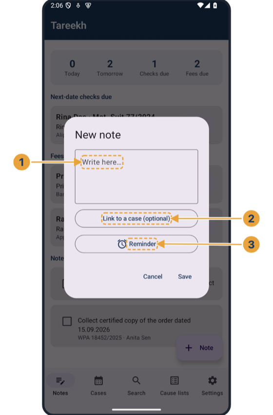</p>

1. **Note**: Anything you need to remember.
2. **Link to a case**: The note then also shows on that case's page.
3. **Reminder**: Pick a date and time; a notification comes then (it opens the case).

### 16 · Settings

Backup, your WhatsApp wording and the look of the app.

<p align="center">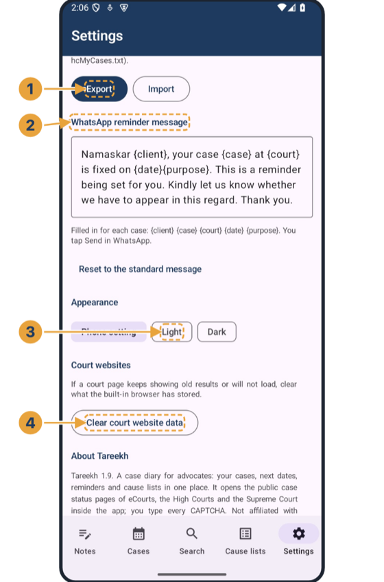</p>

1. **Export / Import**: Save all cases and notes to a backup file (keep it in Google Drive); Import also reads the eCourts app's My Cases export.
2. **WhatsApp reminder message**: Your own wording; {client} {case} {court} {date} {purpose} are filled in for each case.
3. **Appearance**: Phone setting, Light or Dark.
4. **Court websites**: If a court page keeps showing old results, clear what the built-in browser stored.

### 17 · About

Settings › About: the app, the firm and how to reach us.

<p align="center">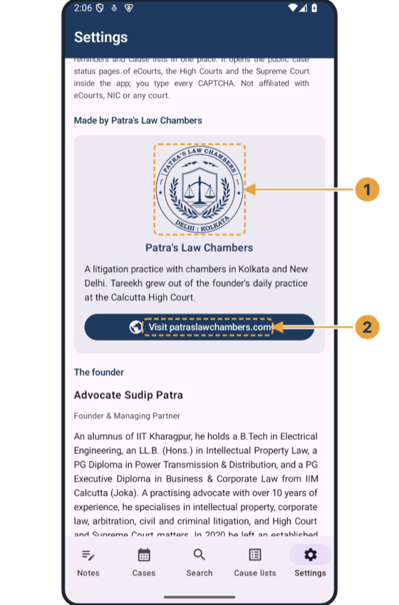</p>

1. **Patra's Law Chambers**: Tareekh is made by Patra's Law Chambers, Kolkata and New Delhi.
2. **Website**: Opens patraslawchambers.com. Call, WhatsApp and Contact buttons are below.

### 18 · Dark mode

Settings › Appearance › Dark (or follow the phone).

<p align="center">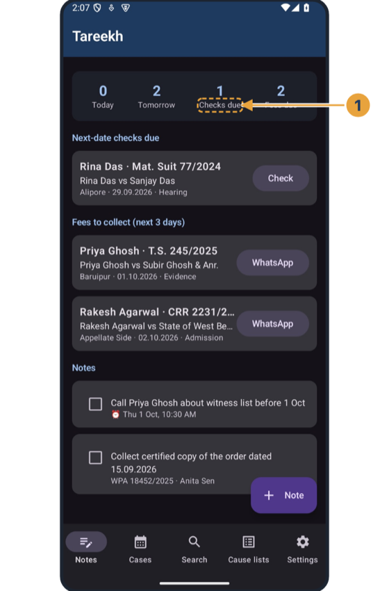</p>

1. **Easy on the eyes**: Every screen, including the court pages' surroundings, works in dark mode.

## Install

<p align="center"><a href="https://github.com/advocatesudippatra-spec/tareekh-court-case-monitoring/raw/main/Tareekh-2.1.apk"></a></p>

1. On your Android phone, tap **Download Tareekh 2.1** above (or [this link](https://github.com/advocatesudippatra-spec/tareekh-court-case-monitoring/raw/main/Tareekh-2.1.apk)); the APK (21 MB) downloads directly.
2. Open it; allow installs from that source once; tap **Install**. A new version installs over the old one and keeps your cases, notes and orders.
3. Open Tareekh and tap **Allow** for notifications and calendar. Set **Battery › Unrestricted** for Tareekh so the 6:30 pm check always comes.
4. Add your cases: **Settings › Import** your eCourts app *My Cases* export, upload documents, or type them.
5. For faster court pages: phone **Settings › Network › Private DNS › `dns.google`** (some internet providers take 5 seconds to find eCourts).


## Your data

- Cases, notes and orders stay **on your phone**. Nothing is sent to Patra's Law Chambers or anyone else.
- **Settings › Export** saves a backup file (cases and notes) to keep in Google Drive; **Import** restores it on a new phone. Copy the `Download/Tareekh` folder to keep the order PDFs.
- Tareekh never types a CAPTCHA and never logs in to anything; it only fills in the court's public search forms.

## Questions

**Does it work without eCourts?** Yes: dates can be entered by hand, and all reminders, the calendar, notes and orders already saved work offline. Only new dates and new orders need the court's website.

**Why do I still type a CAPTCHA?** The courts protect their pages with one, and Tareekh respects it. Everything else on the page is filled in for you.

**Can WhatsApp reminders go by themselves?** WhatsApp does not let any app send from your number without you; Tareekh opens the chat with the message typed and you tap Send.

**Which phones?** Android 8 or later. Some phones (Xiaomi, Oppo, Vivo, Realme) need *Battery › Unrestricted* for the evening check.

## Copyright

© 2026 **Patra's Law Chambers** (Advocate Sudip Patra), Kolkata and New Delhi. **All rights reserved.** Tareekh is proprietary software: its source code is not published. The app may be downloaded and used free of charge for your own practice; it may not be resold, repackaged, modified, decompiled or distributed under another name. The name Tareekh, the guide, the screenshots and the Patra's Law Chambers seal may not be reused without written permission. Permissions: https://patraslawchambers.com/ · +91 890 222 4444.

## About Patra's Law Chambers

<picture>
  <source media="(prefers-color-scheme: dark)" srcset="docs/img/seal-dark.png">
  
</picture>

Tareekh was built and released by **Patra's Law Chambers**, a litigation practice with chambers in Kolkata and New Delhi, out of its founder's daily practice at the Calcutta High Court.

**Advocate Sudip Patra**, Founder & Managing Partner, is an alumnus of IIT Kharagpur, with a B.Tech in Electrical Engineering, an LL.B. (Hons.) in Intellectual Property Law, a PG Diploma in Power Transmission & Distribution and a PG Executive Diploma in Business & Corporate Law from IIM Calcutta (Joka). He has over 10 years of practice in intellectual property, corporate law, arbitration, civil and criminal litigation, and High Court and Supreme Court matters.

Founded in 2020 in Kolkata, with a second chamber in New Delhi since 2023, the firm practises before the Supreme Court of India, the Calcutta High Court, the CAT, the AFT, the DRT and DRAT, the NCLT, and civil and criminal courts.

| | |
|---|---|
| **Kolkata** | NICCO House, 6th Floor, 2 Hare Street, Kolkata 700001 |
| **New Delhi** | 4455/5, 1st Floor, Gali Shahid Bhagat Singh, Paharganj, New Delhi 110055 |
| **Website** | https://patraslawchambers.com/ |
| **Phone / WhatsApp** | +91 890 222 4444 |

---

<p align="center"><a href="https://github.com/advocatesudippatra-spec/tareekh-court-case-monitoring/raw/main/Tareekh-2.1.apk"></a></p>

<p align="center">© 2026 Patra's Law Chambers · All rights reserved</p>

</div>
